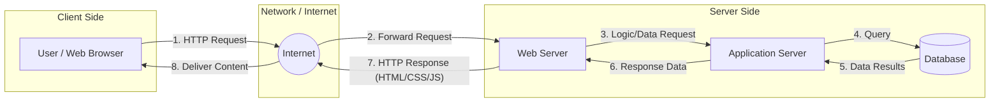

# Assignment 1: Internet Explorer
**Date:** 09/02/2026  
**Subject:** Client-Server Architecture & Web Tracing

---

## 1. Client-Server Architecture

### Overview
The **Client-Server Architecture** is a distributed application framework that partitions tasks or workloads between the providers of a resource or service (servers) and service requesters (clients). In the context of the web:
- **Client:** Typically a web browser (like Chrome, Firefox, or Safari) that initiates requests for resources.
- **Server:** A powerful computer or cluster of computers that hosts the resources (HTML files, CSS, JavaScript, databases) and responds to client requests.
- **Network:** The communication medium (the Internet) through which they interact.

### Architecture Diagram

### Key Components Explained
1. **The Client (Web Browser):**
   - Provides a user interface.
   - Sends HTTP/HTTPS requests to the server.
   - Renders the response (HTML/CSS/JS) into a visual webpage.
2. **The Server (Web/App Server):**
   - Listens for incoming requests on specific ports (80 or 443).
   - Processes business logic and interacts with databases.
   - Sends back a response (usually with a status code like 200 OK).
3. **HTTP/HTTPS Protocols:**
   - The "language" they use to communicate. HTTPS adds a layer of encryption for security.

---

## 2. Tracing What Happens When You Open a Website

When you type a URL like `https://www.google.com` into your browser and press Enter, several complex steps occur in milliseconds:

### Step 1: DNS Lookup (The Phonebook of the Web)
- The browser checks its **cache** for the IP address corresponding to the domain name.
- If not found, it queries the operating system, then the **Router**, then the **ISP's DNS Server**.
- Once the IP address (e.g., `142.250.190.46`) is found, the browser can now "talk" to the server.

### Step 2: TCP Handshake
- The browser initiates a connection with the server using the **TCP/IP protocol**.
- This involves a "Three-Way Handshake":
    1. **SYN:** Client asks to connect.
    2. **SYN-ACK:** Server acknowledges and agrees to connect.
    3. **ACK:** Client acknowledges back, establishing a secure connection.

### Step 3: Sending the HTTP Request
- The browser sends an **HTTP Request** (usually a `GET` request) to the server.
- This request includes headers (cookie info, browser type, etc.) and the specific resource path requested.

### Step 4: Server Processing & Response
- The Web Server receives the request, finds the requested file or generates a response using a backend language (Node.js, Python, etc.).
- The server sends back an **HTTP Response** which includes:
    - **Status Code:** (e.g., `200 OK` or `404 Not Found`).
    - **Response Headers:** Content type, server info, etc.
    - **Body:** The actual HTML content of the page.

### Step 5: Rendering the Webpage
- The browser receives the HTML and begins **parsing** it.
- It identifies external resources like CSS files, images, and JavaScript and makes additional requests for them.
- **Critical Path:**
    1. **DOM Tree:** Created from HTML.
    2. **CSSOM Tree:** Created from CSS.
    3. **Render Tree:** Combination of DOM and CSSOM.
    4. **Layout:** Calculating the exact position of elements.
    5. **Painting:** Filling in pixels on the screen.

### Step 6: JavaScript Execution
- The browser executes JavaScript code, which can make the page interactive or fetch more data without reloading (AJAX).

---
