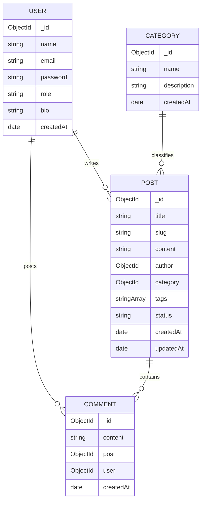

# Blogging Platform: Database Design Document

This document outlines the MongoDB database schema design for a modern blogging platform. The design emphasizes scalability, clear relationships, and data integrity using Mongoose.

## Entity Relationship Diagram

## Schema Definitions

### 1. User Schema
The core of the platform. It handles authentication and roles.
- **Email Validation**: Ensures only valid email formats are stored.
- **Roles**: Supports `user` (reader), `author` (writer), and `admin` (moderator).
- **Security**: Password field is hidden from default queries (`select: false`).

### 2. Post Schema
Handles the blog content and its metadata.
- **Slug Generation**: Automatically converts titles to URL-friendly slugs (e.g., "Hello World" -> "hello-world").
- **Relationships**: Linked to a `User` (Author) and a `Category`.
- **Status Management**: Supports drafting and publishing workflows.

### 3. Comment Schema
Enables interaction between readers and content.
- **Circular Relation**: Linked to both the `Post` it belongs to and the `User` who wrote it.

### 4. Category Schema
Provides a flat taxonomy for organizing posts.
- **Uniqueness**: Prevents duplicate category names to maintain a clean structure.

## Performance Considerations
- **Indexing**: Recommended indexes on `User.email`, `Post.slug`, and `Post.author` for fast lookups.
- **Denormalization**: For high-traffic platforms, we could denormalize the `User` name into the `Comment` schema to reduce joins (lookups).
